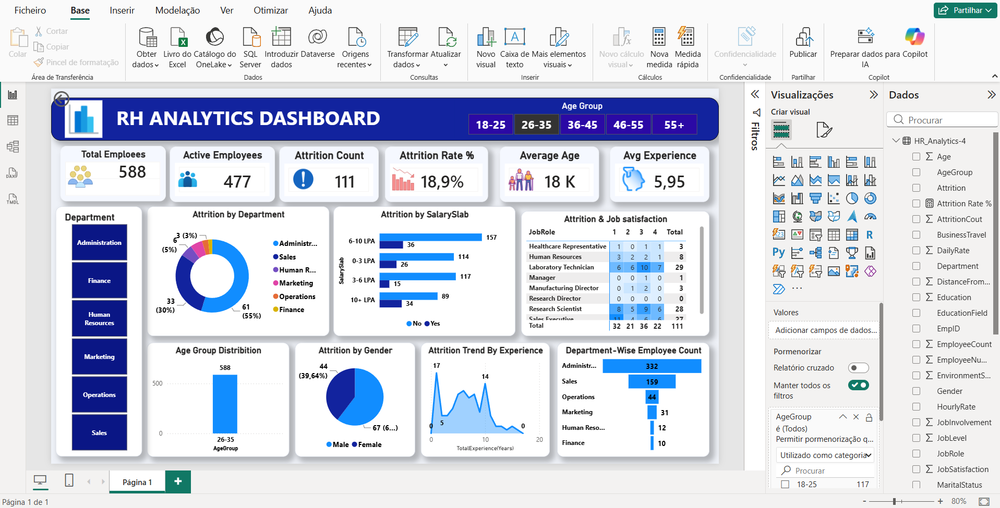
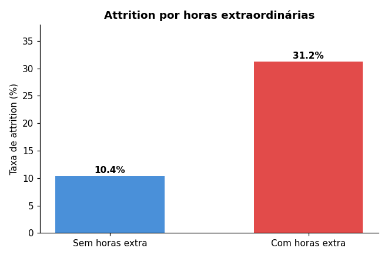
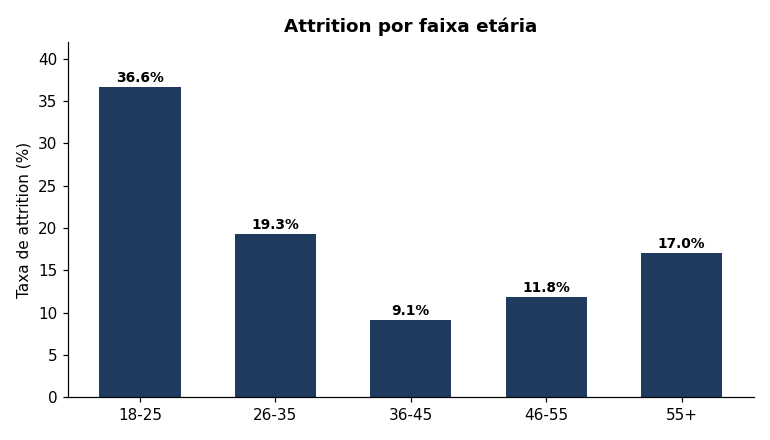
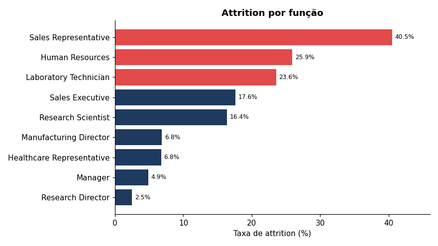
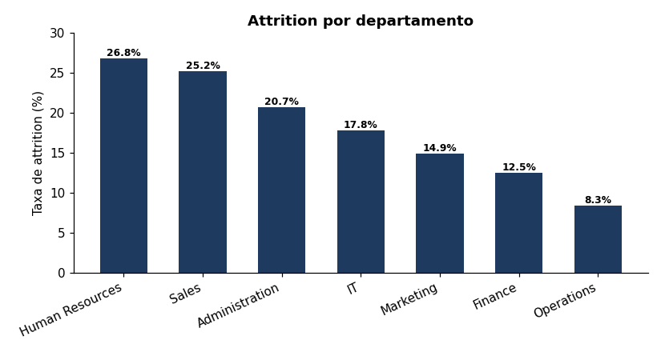

# Dashboard de Análise de Attrition de RH (Power BI)

Análise da rotatividade de colaboradores com um dashboard interativo em **Power BI**,
sobre um dataset público de RH de **1480 colaboradores**.

> **Fonte dos dados:** dataset público de RH (variante enriquecida do *IBM HR
> Attrition*), obtido no Kaggle, dados para fins **educativos**, não dados reais
> de uma empresa.

## Dashboard



Painel único e interativo, com segmentação por faixa etária e departamento:
seis KPIs de topo, análise de attrition por departamento, escalão salarial,
função, satisfação, género e experiência.

## Principais indicadores (dados reais, verificados)

| Indicador | Valor |
|-----------|-------|
| Total de colaboradores | 1480 |
| Colaboradores ativos | 1239 |
| Saídas (*attrition*) | 241 |
| **Taxa de attrition** | **16,3 %** |
| Idade média | 36,9 anos |
| Experiência média | 11,3 anos |

## Padrões encontrados

Todos os valores abaixo foram calculados diretamente sobre o dataset.

**Horas extraordinárias — o sinal mais forte**



Quem faz horas extra sai a **31,2 %**, contra **10,4 %** de quem não faz — cerca
do triplo.

**Faixa etária — os mais novos saem mais**



A faixa dos **18–25 anos** tem a taxa mais alta (36,6 %), decrescendo com a idade.

**Função — funções comerciais e técnicas de base no topo**



*Sales Representative* lidera com **40,5 %**, seguido de *Human Resources* (25,9 %)
e *Laboratory Technician* (23,6 %).

**Departamento**



Por taxa, *Human Resources* (26,8 %) e *Sales* (25,2 %) ficam acima da média;
em volume de saídas, *Administration* concentra 36 % do total.

> **Nota metodológica:** são **associações** num retrato transversal, não relações
> de causa-efeito. Servem para identificar padrões e levantar hipóteses de
> retenção, não para provar causalidade.

## Construção do dashboard (Power BI)

O ficheiro [`powerbi/RH_Project2.pbix`](powerbi/RH_Project2.pbix) contém o
relatório completo. O processo:

1. **Extração** — importação do CSV para o Power BI Desktop.
2. **Transformação (Power Query)** — remoção de colunas constantes
   (`EmployeeCount`, `Over18`, `StandardWorkingHours`), tratamento de valores em
   falta, normalização de categorias inconsistentes (`BusinessTravel`) e correção
   de tipos de dados.
3. **Medidas (DAX)** — KPIs como taxa de attrition
   (`DIVIDE([Total Saídas], [Total Colaboradores])`), contagens e médias.
4. **Visualização** — KPIs, gráficos de anel e barras, matriz de satisfação com
   formatação condicional, e segmentadores interativos por faixa etária e
   departamento.

## Estrutura do repositório

```
data/       HR_Analytics-4.csv · data-dictionary.md
powerbi/    RH_Project2.pbix
images/     dashboard + figuras da análise
```

## Ferramentas

Power BI · Power Query · DAX · análise de dados de RH
